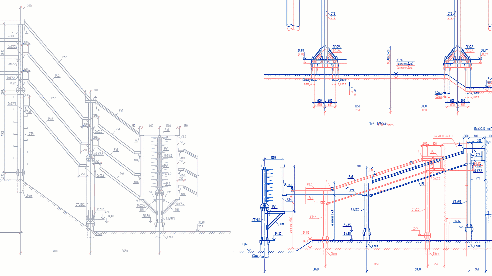

# Imgdiff — Image Comparison Tool (GUI)

**[Русская версия](README.md)** | **English**

Simple and fast image comparison with visual difference highlighting.



- Windows GUI (PyQt5), OpenCV 4.x
- Parallel batch processing
- Overlay with customizable colors for A/B/matches
- Fast saving (auto PNG compression), result caching

## Installation and Launch

```bash
# Install dependencies (if needed)
pip install -r requirements.txt

# Launch GUI
python Imgdiff.py
```

Or download the pre-built Windows executable from [Releases](https://github.com/mikhalchankasm/Imgdiff/releases).

## Basic Steps

1) Select folders A and B, then the output folder.
2) Enable Overlay (checkbox above the viewer) and choose colors:
   - Color A (deleted): red by default (#FF0000)
   - Color B (added): blue by default (#0066FF)
   - Match color: blue by default (#0000FF)
3) Click "Compare" — differing pairs are saved to the output folder.

Tips:
- The vertical "neon" divider line is visible on large images.
- In Overlay mode, a semi-transparent overlay of differences is applied over base image B.

## Advanced Settings (hidden by default)

Optimal values are set by default; expand "Show Advanced Settings" if needed:
- fuzz (sensitivity): 3–10
- thickness (px): 3
- noise suppression: enabled
- min area: 20
- gamma: 1.0
- match tolerance: 0 (off)
- fast ROI core: enabled
- save only diffs: enabled
- PNG compression: auto (or 1 manual)
- Quick pre-check: ~0.10%
- Quick max side: 256
- Workers: ~number of cores (default 4–8)

The "Reset Settings" button restores default values.

## Python API Usage

Imgdiff can be used as a Python library:

```python
from imgdiff import diff_mask_fast, draw_diff_overlay, coarse_to_fine
import cv2

# Load images
img_a = cv2.imread('image_a.png')
img_b = cv2.imread('image_b.png')

# Fast difference mask
mask = diff_mask_fast(img_a, img_b, fuzz=10, use_lab=True)

# Create overlay visualization
overlay = draw_diff_overlay(
    img_b,  # base image
    mask,
    color=(0, 102, 255),  # BGR format
    alpha=0.4,
    gamma=1.0
)

# Save result
cv2.imwrite('result_overlay.png', overlay)

# For faster processing on large images, use coarse-to-fine:
bboxes = coarse_to_fine(img_a, img_b, fuzz=10, min_area=50)
print(f"Found {len(bboxes)} difference regions")
```

See [imgdiff/\_\_init\_\_.py](imgdiff/__init__.py) for all available functions.

## Build / Local Development

All .bat files and helper scripts are moved to `local-dev/` and excluded from releases. They are for local build/publishing only.

## Icon

Program icon: `imgdiff_icon.ico` (available in repository). Use `create_icon.py` script to recreate.

## Versions

- 2.1.1: tooltips, extended help, documentation improvements
- 2.1.0: simplified Overlay, basic/advanced settings, auto PNG compression, cache, neon divider line
- 2.0.0: initial stable version

## Quick UI Cheat Sheet

- Folders A/B: select image folders; pairs are matched by names (natural sort)
- Filter: substring without wildcards. Examples: `mask`, `.png`, `_v2`, `report_2024`
- Colors: HEX or name. Examples: `#FF0000`, `red`, `#0066FF`
- Output folder: where `diff`, `overlay`, `mask` are saved (e.g., `D:\results`)
- Buttons: `⚡ Compare` — start batch; `Pause` — pause/resume; `Stop` — stop after current pair

## Features

### Visualization
- **Overlay** — Semi-transparent colored regions on image with customizable colors for additions/deletions/matches

### Processing
- **Batch Processing** — Multiple image pairs in parallel
- **Caching** — Avoid recomputation of identical pairs
- **Multi-scale** — Coarse-to-fine for 5-20× speedup
- **Alignment** — Auto ECC-based image alignment
- **Noise Filtering** — Median blur + morphological operations

### Performance Optimizations
- Vectorized operations (no Python loops)
- Early exit detection (no differences)
- Morphology only on masks, not full image
- Adaptive ROI scaling (0.15-0.33 based on resolution)
- Quick pre-check ratio to skip identical images

## Benchmarks

| Resolution | v1.x | v2.0+ | Speedup |
|------------|------|-------|---------|
| 1920×1080 | 120ms | 15ms | **8×** |
| 3840×2160 | 480ms | 40ms | **12×** |
| 7680×4320 | 1900ms | 110ms | **17×** |

## License

MIT License. See [LICENSE](LICENSE) file for details.

## Contributing

Contributions are welcome! Please see [CONTRIBUTING.md](CONTRIBUTING.md) for guidelines.

## Issues

Report bugs and feature requests at [GitHub Issues](https://github.com/mikhalchankasm/Imgdiff/issues).
